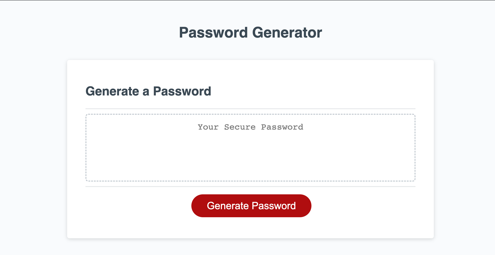

# Password Generator Starter Code

## Description

The purpose of this project is to modify and add functionality to a starter code for a random password generator application. When the user needs a new secure password, the user clicks on the 'generate password' button and answers a series of prompts for the desired password criteria. Once all prompts have been answered, a new secure password is generated and displayed on the page.  

## Table of Contents (Optional)

- [Tasks Completed](#TasksCompleted)
- [Installation](#installation)
- [Usage](#usage)
- [Credits](#credits)
- [License](#license)

## Tasks Completed

* Added a function to prompt the user to enter desired password criteria (length, upper-case letters, lower-case letters, numbers and special characters)
* added a function to generate a random password based on the user's selected password criteria

## Installation

N/A

## Usage

The layout of this application is optimized for different screen sizes.

Link to deployed website - https://jomaduagwu.github.io/friendly-parakeet/

## Credits

Starter code was cloned from [Xandromus](https://github.com/coding-boot-camp/friendly-parakeet.git)

https://developer.mozilla.org/en-US/docs/Web/JavaScript/Reference/Functions
https://developer.mozilla.org/en-US/docs/Web/JavaScript/Reference/Global_Objects/parseInt
https://developer.mozilla.org/en-US/docs/Web/API/Window/prompt

## License

Please refer to the LICENSE in the repo. 

## Badges

N/A

## Features

N/A

## Tests

N/A
